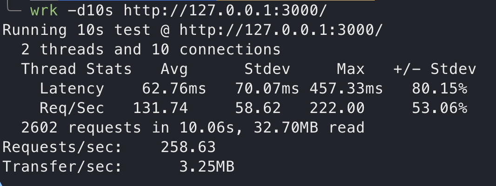

手痒痒, 入门一点点 rails. 

## 1. 安装 Rails

```sh
ruby --version

ruby 2.6.10p210 (2022-04-12 revision 67958) [universal.arm64e-darwin22]
```
嚯有旧的, 装个新的吧.

```sh
brew update
brew install ruby
ruby --version
```

改源
```sh
echo 'export PATH="/opt/homebrew/opt/ruby/bin:$PATH"' >> ~/.zshrc
source ~/.zshrc
```

看看版本
```sh
ruby --version

ruby 3.2.2 (2023-03-30 revision e51014f9c0) [arm64-darwin22]
```
嚯
看看官方文档, https://guides.rubyonrails.org/getting_started.html

装 rails
```sh
gem install rails
```

咋卡住不动, 换源, 还有个 bundle 啥一起换了, https://mirrors.tuna.tsinghua.edu.cn/help/rubygems/
```sh
gem sources --add https://mirrors.tuna.tsinghua.edu.cn/rubygems/ --remove https://rubygems.org/
gem sources -l
bundle config mirror.https://rubygems.org https://mirrors.tuna.tsinghua.edu.cn/rubygems
```

安装
```sh
gem install rails

Fetching webrick-1.8.1.gem
Fetching nokogiri-1.16.0-arm64-darwin.gem
Fetching zeitwerk-2.6.12.gem
Fetching racc-1.7.3.gem
Fetching rack-3.0.8.gem
...
41 gems installed

A new release of RubyGems is available: 3.4.10 → 3.5.3!
Run `gem update --system 3.5.3` to update your installation.
```

装好了, 巴适, 看看版本, gem 太旧了, 更新一下
```sh
gem update --system 3.5.3
```

看看 rails 版本
```sh
rails --version

/System/Library/Frameworks/Ruby.framework/Versions/2.6/usr/lib/ruby/2.6.0/universal-darwin22/rbconfig.rb:21: warning: Insecure world writable dir /Users/bond/.composer in PATH, mode 040777
Rails is not currently installed on this system. To get the latest version, simply type:

    $ sudo gem install rails

You can then rerun your "rails" command.
```

咦, 逗我玩? 你管别的目录干啥? 闲得慌? 算了还是收拾一下
```sh
chmod go-w ~/.composer
```

再看一下版本
```
sh
rails --version
Rails is not currently installed on this system. To get the latest version, simply type:

    $ sudo gem install rails

You can then rerun your "rails" command.
```
过份了啊, 你都知道你装了你咋还骗人呢, 真是, 查半天说要重启终端, 嗐, 哪有这道理. 咋写的代码这是.

好, 可以正常看处版本了
```sh
rails --version
Rails 7.1.2
```

好, 我已经精通了 Ruby/Rails 在 Mac 上的安装了.

## 2. 创建一个新的 rails 项目

建! 嚯, 报一推错
```sh
rails new blog

...
         run  bundle binstubs bundler
/opt/homebrew/opt/ruby/bin/ruby: No such file or directory -- /opt/homebrew/Cellar/ruby/3.2.2_1/lib/ruby/gems/3.2.0/gems/bundler-2.5.3/exe/bundle (LoadError)
       rails  importmap:install
Could not find gem 'sprockets-rails' in locally installed gems.
Run `bundle install` to install missing gems.
       rails  turbo:install stimulus:install
Could not find gem 'sprockets-rails' in locally installed gems.
Run `bundle install` to install missing gems.
```

是要拿 gem 再安装一下 bundler? 整
```sh
gem install bundler

Fetching bundler-2.5.3.gem
Successfully installed bundler-2.5.3
Parsing documentation for bundler-2.5.3
Installing ri documentation for bundler-2.5.3
Done installing documentation for bundler after 0 seconds
1 gem installed
```

好了, 删了刚创建的半截项目, 重新建
```sh
rails new blog

create
create  README.md
create  Rakefile
create  .ruby-vers
      ...
run  bundle install
Fetching source index from https://mirrors.tuna.tsinghua.edu.cn/rubygems/
Resolving dependencies...
...卡半天中, 卡了有 3 分钟以上罢...

Bundle complete! 15 Gemfile dependencies, 84 gems now installed.
Use `bundle info [gemname]` to see where a bundled gem is installed.
         run  bundle lock --add-platform=x86_64-linux
Writing lockfile to /Users/bond/repos/blog/Gemfile.lock
         run  bundle lock --add-platform=aarch64-linux
Writing lockfile to /Users/bond/repos/blog/Gemfile.lock
```

装好了, 耶~ 跑一下看
```sh
cd blog
rails server
```
访问一下, http://127.0.0.1:3000/  耶~


用 [wrk](https://github.com/wg/wrk) 跑个分~

```sh
wrk -d10s http://127.0.0.1:3000/
```


不会吧, 我电脑 M1 Pro 嘛, 赶紧启动个 Laravel 项目看看那个状态, 

```sh
composer create-project laravel/laravel try-laravel-10
...
wrk -d10s http://try-laravel-10.test
```

怎么肥四, 没 Laravel 快?


还是也配置到 Nginx 上来吧, 看来要装个 passenger
看来一开始应先装 rvm, [摔]

```sh
\curl -sSL https://get.rvm.io | bash
rvm install "ruby-3.2.2" --with-openssl-dir=`brew --prefix openssl`

Required ruby-3.2.2 is not installed.
To install do: 'rvm install "ruby-3.2.2"'
Checking requirements for osx.
Certificates bundle '/opt/homebrew/etc/openssl@1.1/cert.pem' is already up to date.
Requirements installation successful.
Installing Ruby from source to: /Users/bond/.rvm/rubies/ruby-3.2.2, this may take a while depending on your cpu(s)...
ruby-3.2.2 - #downloading ruby-3.2.2, this may take a while depending on your connection...
ruby-3.2.2 - #extracting ruby-3.2.2 to /Users/bond/.rvm/src/ruby-3.2.2.....
ruby-3.2.2 - #autogen.sh.
ruby-3.2.2 - #configuring....................................................................
ruby-3.2.2 - #post-configuration.
ruby-3.2.2 - #compiling....................................................................................................
ruby-3.2.2 - #installing...............
ruby-3.2.2 - #making binaries executable...
Installed rubygems 3.4.10 is newer than 3.0.9 provided with installed ruby, skipping installation, use --force to force installation.
ruby-3.2.2 - #gemset created /Users/bond/.rvm/gems/ruby-3.2.2@global
ruby-3.2.2 - #importing gemset /Users/bond/.rvm/gemsets/global.gems................................................................
ruby-3.2.2 - #generating global wrappers........
ruby-3.2.2 - #gemset created /Users/bond/.rvm/gems/ruby-3.2.2
ruby-3.2.2 - #importing gemsetfile /Users/bond/.rvm/gemsets/default.gems evaluated to empty gem list
ruby-3.2.2 - #generating default wrappers........
ruby-3.2.2 - #adjusting #shebangs for (gem irb erb ri rdoc testrb rake).
Install of ruby-3.2.2 - #complete
Ruby was built without documentation, to build it run: rvm docs generate-ri
```

慢死了, 终于装好了, 切换过来, 从 ~/.zshrc 注释掉刚加到 homebrew 装的 ruby 别名
```sh
rvm --default use 3.2.2
ruby --version

ruby 3.2.2 (2023-03-30 revision e51014f9c0) [arm64-darwin22]

which ruby

/Users/bond/.rvm/rubies/ruby-3.2.2/bin/ruby
```

shufule~ 装 passenger, 不知道干啥的, 可能像 php-fpm 一样?
```sh
gem install passenger

Fetching rack-3.0.8.gem
Fetching passenger-6.0.19.gem
Successfully installed rack-3.0.8
Building native extensions. This could take a while...
Successfully installed passenger-6.0.19
Parsing documentation for rack-3.0.8
Installing ri documentation for rack-3.0.8
Parsing documentation for passenger-6.0.19
Installing ri documentation for passenger-6.0.19
Done installing documentation for rack, passenger after 24 seconds
2 gems installed
```

装好了, 大约用了一万年, 再重装下 nginx

```sh
brew install nginx --with-passenger

Error: invalid option: --with-passenger
```

好家伙你几个意思, 好吧, 你改了. 

```sh
brew install passenger
brew info passenger

...
To activate Phusion Passenger for Nginx, run:
  brew install nginx
And add the following to /opt/homebrew/etc/nginx/nginx.conf at the top scope (outside http{}):
  load_module /opt/homebrew/opt/passenger/libexec/modules/ngx_http_passenger_module.so;
And add the following to /opt/homebrew/etc/nginx/nginx.conf in the http scope:
  passenger_root /opt/homebrew/opt/passenger/libexec/src/ruby_supportlib/phusion_passenger/locations.ini;
  passenger_ruby /usr/bin/ruby;

To activate Phusion Passenger for Apache, create /etc/apache2/other/passenger.conf:
  LoadModule passenger_module /opt/homebrew/opt/passenger/libexec/buildout/apache2/mod_passenger.so
  PassengerRoot /opt/homebrew/opt/passenger/libexec/src/ruby_supportlib/phusion_passenger/locations.ini
  PassengerDefaultRuby /usr/bin/ruby
==> Analytics
install: 108 (30 days), 434 (90 days), 1,532 (365 days)
install-on-request: 106 (30 days), 426 (90 days), 1,497 (365 days)
build-error: 0 (30 days)
```

仔细查看上面的 info, 按说明, 开始配置 nginx.

```nginx
#user  nobody;
user bond staff;
worker_processes  1;

#error_log  logs/error.log;
#error_log  logs/error.log  notice;
#error_log  logs/error.log  info;

#pid        logs/nginx.pid;

# 看这里
load_module /opt/homebrew/opt/passenger/libexec/modules/ngx_http_passenger_module.so;

events {
    worker_connections  1024;
}

http {
    // ...

    # 看这里
    passenger_root /opt/homebrew/opt/passenger/libexec/src/ruby_supportlib/phusion_passenger/locations.ini;
    passenger_ruby /usr/bin/ruby;

    include servers/*;
}
```

然后是加个 vhost 文件, 例如叫 `try-rails-7.conf

```nginx
# 这是无效配置, 不要参考
server {
    listen 80;
    http2 on;
    server_name try-rails-7.test;
    index index.html index.htm;
    root /Users/bond/repos/try-rails-7/public;

    location / {
        try_files $uri $uri/ /index.html?$query_string;
    }

    passenger_enabled on;
    passenger_ruby /Users/bond/.rvm/gems/ruby-3.2.2/wrappers/ruby;
}
```


苍天哪, 你给点面子吧, 这都是些啥? 这是你为了避免小白入门设的门槛吗? 我******

罢了, 看看日志
```log
App 58748 output: Error: The application encountered the following error: Could not find rails-7.1.2, sprockets-rails-3.4.2, sqlite3-1.7.0-
```

那我重装下依赖? 
```sh
bundle install
```

嚯, 还自动给我跳到 https, 我本地可没配, 搜索一番, 还是在项目里关(这个配置在 production.rb 里, 目测根据后面 nginx 里配置应就指定使用 development.rb 配置了, 这个应仅用于生产环境即可, 本地开发不用改为 false)
```ruby
config.force_ssl = false
```

打开页面还显示
`The page you were looking for doesn't exist.`

Fine, 我创建个页面
```
rails generate controller Greetings index --skip-routes
      create  app/controllers/greetings_controller.rb
      invoke  erb
      create    app/views/greetings
      create    app/views/greetings/index.html.erb
      invoke  test_unit
      create    test/cont   ollers/greetings_controller_test.rb
      invoke  helper
      create    app/helpers/greetings_helper.rb
      invoke    test_unit
```

`Blocked hosts: try-rails-7.test`

额, 我要吐血了, 把下面这行加到 development.rb 里 `Rails.application.configure do` 下.

```ruby
config.hosts << "try-rails-7.test"
```


试试 hello world 页

404? 蛤? 404?

一通捣鼓, 最终看来还是 nginx 配置没写对, 让 AI 帮写下配置
```nginx
server {
    listen 80;
    http2 on;
    server_name try-rails-7.test;
    index index.html index.htm;
    root /Users/bond/repos/try-rails-7/public;

    location / {
        try_files $uri @passenger;
    }

    location @passenger {
        passenger_enabled on;
        passenger_app_env development;
        passenger_ruby /Users/bond/.rvm/gems/ruby-3.2.2/wrappers/ruby;
    }
}
```


我心如止水. 跑个分.


## Troubleshooting

- [Insecure world writable dir /Users/username in PATH, mode 040777](https://stackoverflow.com/questions/6192003/insecure-world-writable-dir-users-username-in-path-mode-040777-when-running-ru)
- [cannot load such file -- bundler/setup (LoadError)](https://stackoverflow.com/questions/19061774/cannot-load-such-file-bundler-setup-loaderror)
- [Rails application (localhost) automatically redirecting to HTTPS](https://stackoverflow.com/questions/22174813/rails-application-localhost-automatically-redirecting-to-https)
- [Blocked hosts](https://stackoverflow.com/questions/53878453/upgraded-rails-to-6-getting-blocked-host-error)


## 参考文档
- 官网 getting started 文档 https://guides.rubyonrails.org/getting_started.html
- rubygem 源 https://mirrors.tuna.tsinghua.edu.cn/help/rubygems/
- nginx 配置
  - https://www.codewithjason.com/add-rails-application-nginx-server/
  - https://www.phusionpassenger.com/library/install/nginx/install/oss/osx/
  - https://www.bacancytechnology.com/blog/deploy-ror-app-using-nginx
- ruby 版本管理器 RVM
  - https://rvm.io/rvm/install
  - https://rvm.io/rubies/default
